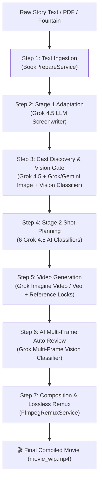

# Nick and Me / Film Studio

AI film pipeline: book or screenplay → cast locks → shot plan → Grok video → review → WIP movie.

**Product runtime is .NET only** (Blazor UI + C# API/engine under `host/`).  
No Python runtime is required.

## Run (Film Studio)

Needs:

- .NET SDK (solution targets `net10.0`)
- `XAI_API_KEY` for real Stage 1 / images / video / vision (optional fakes for UI soaks)
- ffmpeg is **bundled** with the API on Windows (override with `FilmStudio:FfmpegPath` if needed)

### 1) API / engine (`http://127.0.0.1:5088`)

```powershell
cd host
$env:FilmStudio__WorkspaceRoot = (Resolve-Path ..).Path
$env:FilmStudio__UseFakes = "false"   # "true" for no xAI spend
$env:XAI_API_KEY = "your-key"         # required when UseFakes=false
$env:ASPNETCORE_URLS = "http://127.0.0.1:5088"
dotnet run --project FilmStudio.Api
```

Health: `GET http://127.0.0.1:5088/health`

### 2) Blazor UI (`http://localhost:5079`)

```powershell
cd host
$env:EngineApi__BaseUrl = "http://127.0.0.1:5088"
$env:ASPNETCORE_URLS = "http://localhost:5079"
dotnet run --project FilmStudio.Web
```

Open the UI (admin learning, cast, scenes, review).  
You need **both** Api and Web. If only Web is running, API calls fail.

### Visual Studio

Open `host/FilmStudio.slnx`, set **multiple startup projects**: Api + Web.

More detail: **`host/README.md`**.

## Layout

| Path | Role |
|------|------|
| `host/` | **Film Studio** — Api, Web, Engine, Tests, LoadSim, Playwright pilot |
| `projects/<id>/` | Per-film cast, blueprint, config, state, assets, WIP |
| `projects/workspace.json` | Active project pointer |
| `prompts/` | Stage 1/2, fountain/cast, gen pack, auto-review, shared rules |
| `_learning/` | Host-level learning checklist (`proposal_checklist.json`) |
| `docs/` | Learning loop, loadsim, two-stage notes |
| `host/playwright/` | E2E pilot (Node + Playwright) against real or fakes API |
| `scripts/` | Optional maintenance helpers (prefer Blazor / API for product work) |

## Typical operator flow

1. Create / activate a project  
2. Import book or Fountain → sign off screenplay  
3. **Build cast** → generate + lock portraits (style gate) + voices  
4. Build shot plan (Stage 2)  
5. Generate scenes (cast must be ready)  
6. Auto-review + Pass/Fail (assembly gate: fails stay out of WIP unless override)  
7. Remux scene composites + rebuild WIP  
8. Admin Learning: propose rules, approve into project rules / checklist  

---

## How Film Studio Converts Source Text to a Movie (Step-by-Step AI Pipeline)



### 1. Source Text Ingestion (`BookPrepareService`)
- **Input**: Raw text (`.txt`), PDF book, or existing Fountain screenplay (`.fountain`).
- **Processing**: Cleans Gutenberg headers/boilerplate, normalizes line breaks, extracts chapter boundaries, and formats source text chunks for adaptation.

### 2. Stage 1: Screenplay Adaptation (`BookToFountainConverter`)
- **AI Engine**: **Grok 4.5 LLM (`book_to_fountain`)**
- **Action**: Converts raw book prose into a valid **Fountain 1.1** screenplay containing filmable scene headings (`INT.`/`EXT.`), visual action prose, character dialogue, and voiceover (`V.O.`).
- **Automated AI Recovery**: Verifies screenplay formatting against strict Fountain syntax rules. If scene headings or dialogue cues contain formatting errors, specialized AI fixup passes (`book_to_fountain_locations_retry`, `book_to_fountain_speakers_retry`) resolve errors automatically without human intervention.

### 3. Character Discovery & Visual Style Lock (`CastFromScreenplayService` & `CharacterDesignService`)
- **AI Engine**: **Grok 4.5 LLM (`cast_from_screenplay`)** + **Grok Imagine Image / Gemini Image** + **Grok Vision Classifier**
- **Action**:
  1. **Character Extraction**: AI analyzes the screenplay to extract character identities, species, estimated age, build, clothing, and visual locks (unvarying physical traits).
  2. **Portrait Generation**: Generates candidate reference portraits for each character.
  3. **AI Vision Style Gate (`RequirePortraitStyleGate`)**: An AI Vision Classifier audits generated portraits against the project's global render style (e.g. *period live-action gothic* vs. *3D CG animation*) before locking, ensuring zero visual style drift across the cast.

### 4. Stage 2: Shot Planning & AI Classifier Suite (`Stage2PlannerService`)
- **AI Engine**: **8 Specialized Grok 4.5 Classifiers**
- **Action**: Transforms the Fountain screenplay into a frame-accurate, timestamped shot plan (`blueprint.clips.json`) using 8 AI classifiers:
  1. **`OnScreenCastClassifier`**: Evaluates dialogue and action per beat to determine on-screen vs. off-screen/VO characters per shot, enforcing off-camera speaker rules.
  2. **`SilentBeatActionClassifier`**: Classifies silent action beats (`action_class`) with surrounding narrative context to allocate precise duration budgets ($3\text{s}$–$8\text{s}$).
  3. **`AmbientSfxClassifier`**: Separates background ambient soundscapes from transient sound effects (SFX).
  4. **`SpeciesKindClassifier`**: Categorizes character body types (`animal`, `human`, `other`) to enforce prompt framing rules.
  5. **`ExtendCutClassifier`**: Determines continuity transitions (`extend_previous` vs. `hard_cut`).
  6. **`ShotPlanRefiningClassifier`**: Evaluates multi-clip monologues to generate progressive camera angles (Establishing Wide $\rightarrow$ Close-Up on detail $\rightarrow$ Reaction Shot), eliminating static visual prompt repetition across extended scenes.
  7. **`BeatPacingClassifier`**: Analyzes narrative rhythm, suspense, and emotional weight to assign dynamic clip duration budgets ($2\text{s}$–$12\text{s}$) tailored to scene tension.
  8. **`CinematicLightingClassifier`**: Generates rich atmospheric lighting descriptions, shadow quality, volumetric effects, and mood color palettes locked across all shots in a scene.
- **Deterministic Pacing**: *Silent Prelude Coalescing* automatically folds 5s silent lead-in beats into Beat 2 so voiceover/dialogue begins on frame 1 of the scene.

### 5. Video Generation (`ClipVideoPromptBuilder` & `GrokVideoClient` / `GeminiVideoClient`)
- **AI Engine**: **Grok Imagine Video / Veo**
- **Action**: Constructs 4,000-character prompts incorporating style locks, on-screen cast counts, visual action prose, and locked character reference images (`<IMAGE_1>`, `<IMAGE_2>`).
- **Identity Attachment**: Attaches locked reference image plates directly to the video generation API call for 100% character face and wardrobe consistency across shots.

### 6. AI Multi-Frame Auto-Review (`ClipAutoReviewService`)
- **AI Engine**: **Grok Multi-Frame Vision (`CompleteWithImagesAsync`)**
- **Action**: Inspects generated video clip frames (head, mid, tail) alongside the previous clip's tail frame.
- **Quality Audit**: Audits character identity consistency, visual artifacts, and style adherence, assigning `Pass` or `Fail` with automated assembly gates that prevent bad clips from reaching the final movie build.

### 7. Composition & Lossless Remux (`FfmpegRemuxService`)
- **Engine**: Native `ffmpeg` remuxing pipeline.
- **Action**: Filters clips passing the assembly gate, layers audio tracks (dialogue, ambient, SFX, music bed), performs lossy/lossless ffmpeg remux, and compiles the final movie draft (`movie_wip.mp4`).

---

## Playwright pilot

```powershell
cd host/playwright
npm install
$env:API_URL = "http://127.0.0.1:5088"
$env:WEB_URL = "http://localhost:5079"
$env:FULL_MOVIE = "1"          # optional
$env:PROJECT_NAME = "MyPilot"
npm run pilot
```

See `host/playwright/README.md`.

## Tests

```powershell
cd host
dotnet test FilmStudio.Tests
```

## Docs

| Doc | Topic |
|-----|--------|
| `host/README.md` | API routes, SignalR, LoadSim, capability matrix |
| `host/docs/` | Multi-user / loadsim soak |
| `prompts/README.md` | Prompt packs and schemas |
| `docs/learning_loop.md` | Feedback / dirty flags (concept) |

## Config notes

- Workspace root: `FilmStudio:WorkspaceRoot` (empty → auto-detect repo root from API).  
- Fakes: `FilmStudio:UseFakes` / `FILMSTUDIO_USE_FAKES=true`.  
- Auth (dev): admin bypass headers / appsettings under `FilmStudio:Auth`.  
